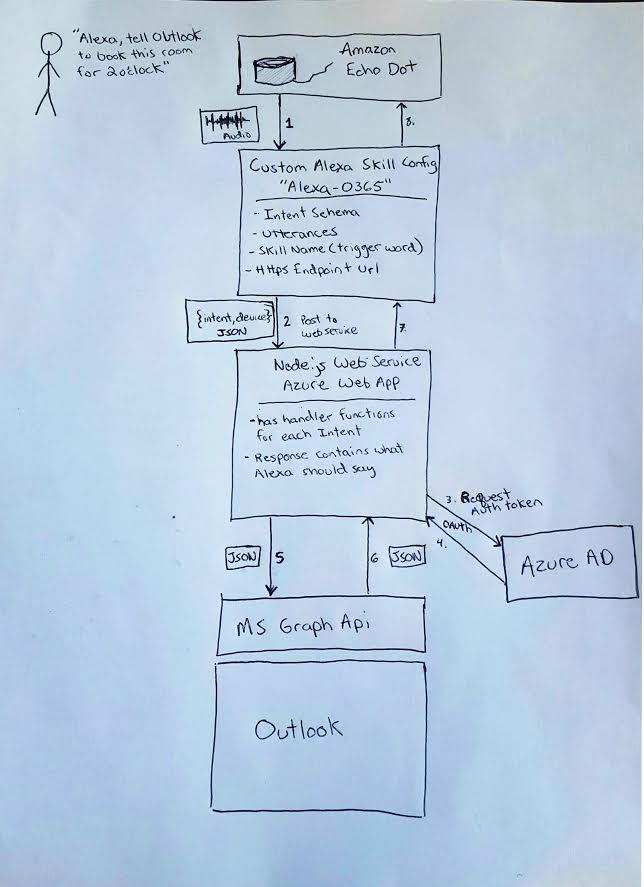

# Alexa Office 365 Skill


## Useful links
* [VSTS Work Items](https://skyline.visualstudio.com/Skyline-DevCamp-Alexa/_backlogs/board/Backlog%20items)
* [Amazon Custom Skill Developer Portal](https://developer.amazon.com/edw/home.html#/skills/list)
* [Azure Web Service](https://alexa-demo.azurewebsites.net)
* [Amazon - Steps to build a custom Alexa Skill](https://developer.amazon.com/public/solutions/alexa/alexa-skills-kit/overviews/steps-to-build-a-custom-skill)
* [Amazon - Interaction Model Docs](https://developer.amazon.com/public/solutions/alexa/alexa-skills-kit/docs/alexa-skills-kit-interaction-model-reference)
* [Graph API -Find Meeting Times](https://graph.microsoft.io/en-us/docs/api-reference/beta/api/user_findmeetingtimes)
* [Graph API - Events](https://graph.microsoft.io/en-us/docs/api-reference/v1.0/resources/event)
* [Outlook API - Fuzzy People Search](https://msdn.microsoft.com/en-us/office/office365/api/people-rest-operations#SearchPeople)

## Installation & Setup

### Required Installs
* [Node.js](https://nodejs.org/en/)
* [GIT for Windows](https://git-scm.com/download/win)

### Recommended Installs
* [Visual Studio Code](http://code.visualstudio.com) - Great node.js debugging
* [ngrok](https://www.npmjs.com/package/ngrok) - Temporarily make your local web server publically accessible w/ https
    * Install: `npm install -g ngrok`
    * Usage (host port 3000): `ngrok http 3000`

### Project Setup

#### Get the Code

Open up a terminal and clone the GIT repository from Skyline VSTS
```
git clone https://skyline.visualstudio.com/Skyline-DevCamp-Alexa/_git/alexa-o365
```

#### Install the dependencies
Change directories into the cloned project and install the NPM dependencies
```
cd alexa-o365
npm install
```

#### Start the Web Service
You can type `npm run start` from the terminal, or hit F5 in VS Code to debug it.

## Web Service Endpoints

* GET [/alexa](http://localhost:3000/alexa) - Output skill schema and utterances
* POST [/alexa](http://localhost:3000/alexa) - The endpoint Amazon Skill will be configured to post to.
* GET [/alexa/tools](http://localhost:3000) - Utterance builder GUI


## Useful GIT Commands
Clone the repository
```
git clone https://skyline.visualstudio.com/Skyline-DevCamp-Alexa/_git/alexa-o365
```
Switch to the 'dev' branch
```
git checkout dev
```
See whats up (what branch you're on, whats staged, whats comitted)
```
git status
```
Commit all your changes.  (VS Code handles this very nicely but if you want to do it from terminal...)
```
git add -A
git commit -m "added the new thingy-ma-bob"
```
Push your commits to the VSTS dev branch
```
git push origin dev
```
## Architecture
When a user speaks to the Dot with the skill trigger word ("outlook")

1. Amazon Custom Alexa Skill configuration picks it up and maps it to a registered intent. Then passes the request through as JSON to the specified HTTPS endpoint
2. A node.js web service will parse the POST body to execute the proper Intent handler function
3. In order to talk to the Graph API, we need an auth token from Azure AD.  We'll pass a pre registered app id and secret.
4. Azure AD gives us back an access token to add to the HEADER of our Graph request
5. We make POST request to the office graph /events endpoint to create a calendar events
6. Graph API responds with succes or fail
7. Node web service converts the Graph API result into w/e Alexa should say
8. Alexa responds to the user



## Utterance builder
Typing out all the different ways a user might want to trigger an intent can be very tedious.  To help, I've built an Utterance Builder GUI. It can be accessed at `/alexa/tools`.


